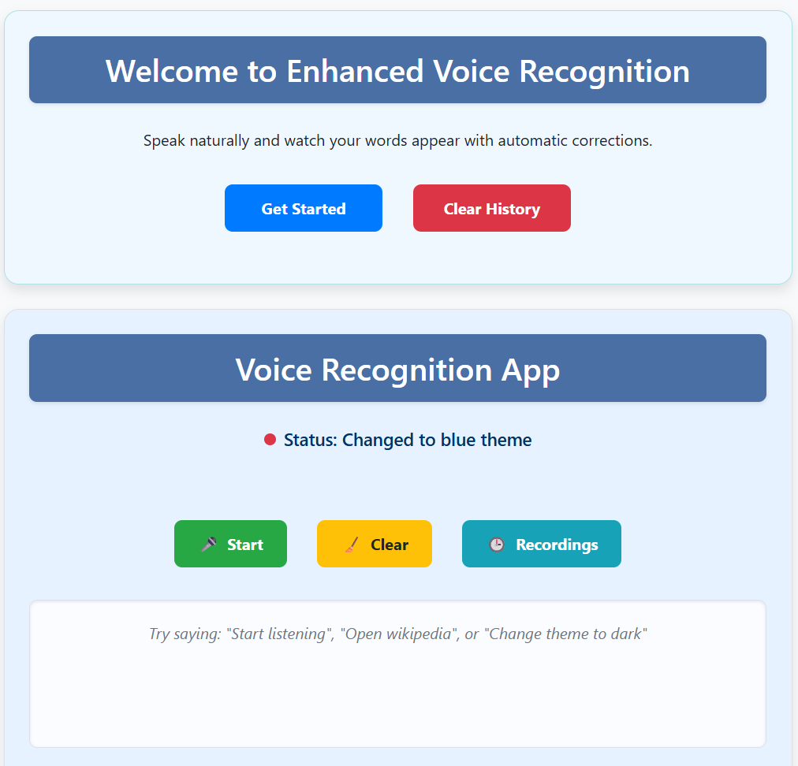
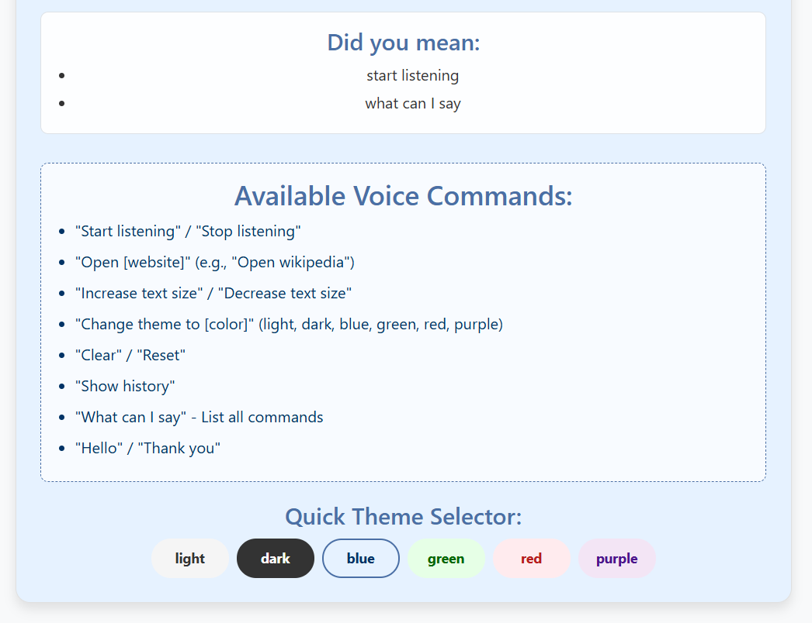
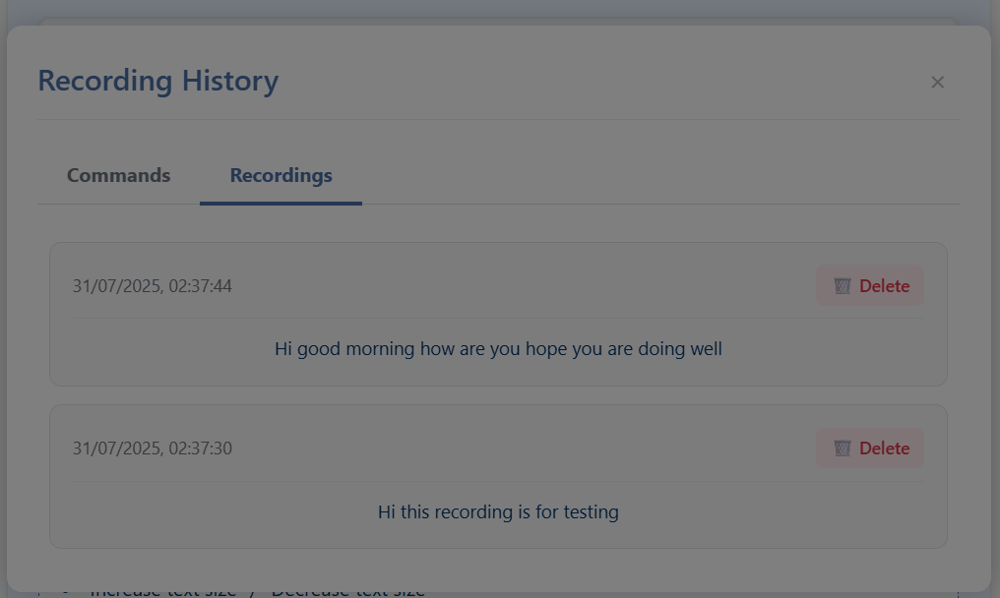

# Voice Recognition App

A React-based voice recognition application with automatic text correction, command execution, and history tracking.







## Features

- 🎤 Real-time voice-to-text conversion
- ✍️ Automatic spelling correction
- 📜 Command history tracking
- 🎨 Customizable themes
- 📝 Text size adjustment
- 🔍 Command suggestions
- 🗑️ Delete history items

## Tech Stack

- **Frontend**: 
  - React.js
  - react-speech-recognition
  - Context API (State Management)
- **Styling**:
  - CSS3 (with animations)
  - Responsive design
- **Build Tool**:
  - Create React App

## Requirements

- Node.js (v14 or higher)
- npm (v6 or higher) or yarn
- Modern browser with Web Speech API support (Chrome, Edge recommended)

## Installation

1. Clone the repository:
   ```bash
   git clone https://github.com/yourusername/voice-recognition-app.git
   cd voice-recognition-app

2. Install dependencies:

   ```bash
   npm install
   # or
   yarn install
   
3. Start the development server:

   ```bash
   npm start
   # or
   yarn start
   
4. Open your browser and navigate to:

    ```text
    http://localhost:3000
